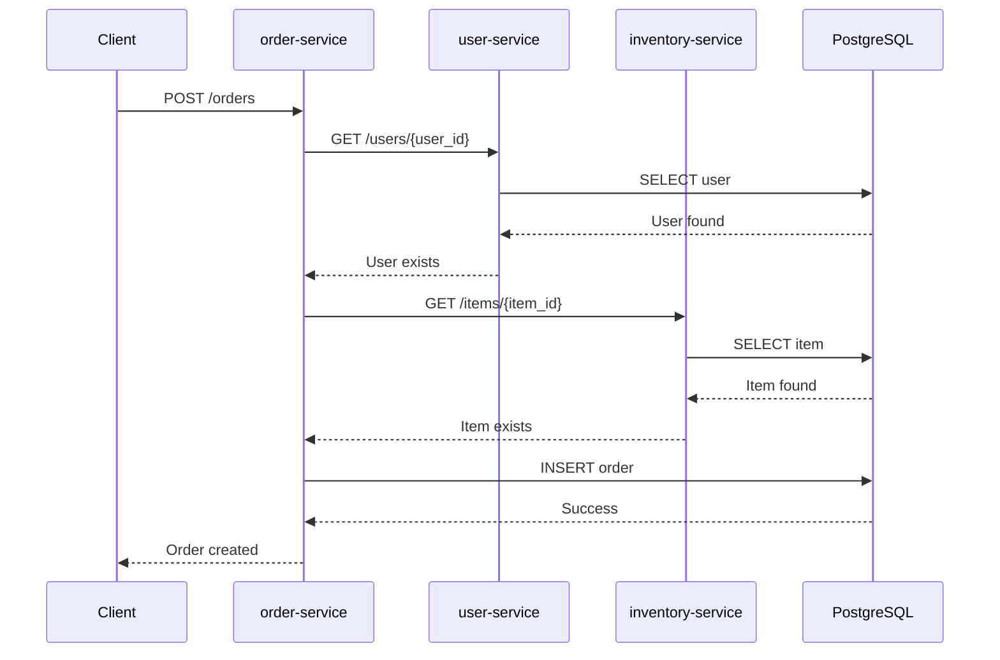
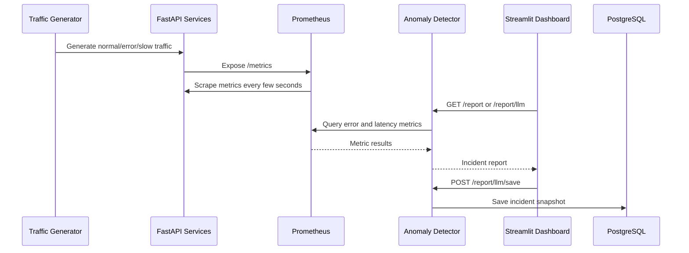
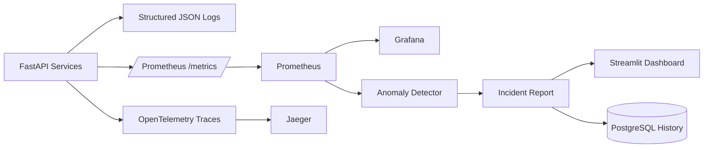

# AI Incident Copilot

**AI Incident Copilot** is an AI-powered observability and incident response platform for microservices. It simulates a production-style distributed system, collects logs, metrics, and traces, detects anomalies from Prometheus metrics, generates incident reports with root-cause hypotheses and recommended actions, and displays everything in a Streamlit-based copilot dashboard.

The project is designed as a portfolio-ready backend/platform engineering project that demonstrates microservices architecture, observability, anomaly detection, incident response automation, LLM integration, CI testing, and production-style developer tooling.

---

## Table of Contents

* [Overview](#overview)
* [Why This Project](#why-this-project)
* [Tech Stack](#tech-stack)
* [System Components](#system-components)
* [Features](#features)
* [Observability Pipeline](#observability-pipeline)
* [Incident Detection Flow](#incident-detection-flow)
* [Environment Variables](#environment-variables)
* [Main URLs](#main-urls)
* [Useful Commands](#useful-commands)
* [Project Structure](#project-structure)


---

## Overview

AI Incident Copilot provides a local, Docker Compose-based observability environment for a simulated microservices application.

The system includes:

* Multiple FastAPI microservices
* PostgreSQL persistence
* Structured JSON logs
* Prometheus metrics
* Grafana dashboards
* OpenTelemetry distributed tracing
* Jaeger trace visualization
* Failure injection endpoints
* Traffic generation service
* Prometheus-based anomaly detection
* Rule-based incident report generation
* LLM-powered incident analysis
* Streamlit incident copilot dashboard
* Incident history persistence
* Pytest integration tests
* GitHub Actions CI
* Ruff linting and formatting
* Makefile-based developer workflow

The project can be run locally with one command and demonstrated through a repeatable incident simulation flow.

---

## Why This Project

Modern backend systems often fail in distributed and hard-to-debug ways.

A single user-facing incident may involve:

* One service returning HTTP 500 errors
* Another service becoming slow
* A database dependency timing out
* Cascading failures across service boundaries
* Missing context across logs, metrics, traces, and dashboards

In real engineering teams, incident response often requires manually checking:

* Logs
* Metrics
* Dashboards
* Traces
* Recent deployments
* Service dependencies
* Error rates
* Latency spikes

AI Incident Copilot explores how an incident assistant can help engineers move faster by automatically collecting signals, detecting anomalies, summarizing likely causes, recommending next steps, and saving incident snapshots for later review.


## Request Flow Example

When a client creates an order, the order service validates that the user and item exist before saving the order.



---

## Incident Detection Flow



---

## Tech Stack

| Category          | Technology                      |
| ----------------- | ------------------------------- |
| Backend           | Python, FastAPI                 |
| API Validation    | Pydantic                        |
| Database          | PostgreSQL                      |
| Containers        | Docker, Docker Compose          |
| Metrics           | Prometheus, prometheus-client   |
| Dashboards        | Grafana, Streamlit              |
| Tracing           | OpenTelemetry, Jaeger           |
| Logging           | Structured JSON logs            |
| HTTP Clients      | httpx, requests                 |
| AI / LLM          | Optional OpenAI API integration |
| Testing           | Pytest, smoke tests             |
| CI/CD             | GitHub Actions                  |
| Code Quality      | Ruff                            |
| Developer Tooling | Makefile, shell scripts         |

---

## System Components

| Component          |              Local URL | Purpose                                           |
| ------------------ | ---------------------: | ------------------------------------------------- |
| order-service      |  http://localhost:8001 | Handles order creation and validates users/items  |
| user-service       |  http://localhost:8002 | Handles user creation and lookup                  |
| inventory-service  |  http://localhost:8003 | Handles item creation and lookup                  |
| anomaly-detector   |  http://localhost:8004 | Queries Prometheus and generates incident reports |
| traffic-generator  |  http://localhost:8005 | Generates normal, error, slow, and mixed traffic  |
| incident-dashboard |  http://localhost:8501 | Streamlit incident copilot dashboard              |
| Prometheus         |  http://localhost:9090 | Scrapes and stores metrics                        |
| Grafana            |  http://localhost:3000 | Visualizes metrics                                |
| Jaeger             | http://localhost:16686 | Visualizes distributed traces                     |
| PostgreSQL         |         localhost:5432 | Stores application data and incident history      |

---

## Features

### 1. Microservices Backend

The project includes three core business services:

* `user-service`
* `inventory-service`
* `order-service`

Each service is a standalone FastAPI application with its own API routes, Dockerfile, health endpoint, metrics endpoint, structured logging, and tracing.

The `order-service` communicates with `user-service` and `inventory-service` before creating an order.

---

### 2. PostgreSQL Persistence

PostgreSQL is used for:

* Users
* Inventory items
* Orders
* Incident report snapshots
* LLM report snapshots

The services create their own tables on startup for local development simplicity.

---

### 3. Structured JSON Logging

Each FastAPI service emits structured JSON logs including:

* Timestamp
* Log level
* Service name
* Logger name
* Request ID
* HTTP method
* Path
* Status code
* Duration
* Client IP
* Error type
* Business event fields

Example log:

```json
{
  "timestamp": "2026-06-30T12:00:00.000000+00:00",
  "level": "INFO",
  "service": "order-service",
  "logger": "app.main",
  "message": "request completed",
  "request_id": "b3d1...",
  "method": "POST",
  "path": "/orders",
  "status_code": 200,
  "duration_ms": 32.4
}
```

---

### 4. Prometheus Metrics

Each service exposes Prometheus-compatible metrics at `/metrics`.

Tracked metrics include:

* Total HTTP requests
* Request latency histogram
* HTTP error count
* Method labels
* Path labels
* Status code labels
* Service labels

Example Prometheus metric:

```txt
http_requests_total{method="GET",path="/health",service="order-service",status_code="200"} 10
```

---

### 5. Grafana Dashboard

Grafana visualizes service-level metrics from Prometheus.

Dashboard panels include:

* Total requests by service
* Request rate by service
* Average latency by service
* Error count by service

Grafana login:

```txt
username: admin
password: admin
```

---

### 6. Failure Injection

Each service includes failure simulation endpoints:

```txt
GET /simulate/error
GET /simulate/slow?delay_seconds=3
```

These endpoints intentionally create errors and latency so the observability system can be tested.

Example:

```bash
curl http://localhost:8001/simulate/error
curl "http://localhost:8002/simulate/slow?delay_seconds=3"
```

---

### 7. Traffic Generator

The `traffic-generator` service creates repeatable demo scenarios.

Supported scenarios:

```txt
POST /generate/normal
POST /generate/errors
POST /generate/slow
POST /generate/mixed
```

Example:

```bash
curl -X POST "http://localhost:8005/generate/mixed"
```

This creates a mix of normal traffic, service errors, and slow requests.

---

### 8. Anomaly Detection

The `anomaly-detector` queries Prometheus and detects:

* High error count
* High latency

Example detection response:

```json
{
  "service": "anomaly-detector",
  "status": "incident_detected",
  "incident_count": 2,
  "incidents": [
    {
      "type": "high_error_count",
      "service": "order-service",
      "severity": "critical",
      "value": 5,
      "threshold": 1,
      "message": "order-service has 5 errors in the last 5 minutes"
    }
  ]
}
```

---

### 9. Incident Report Generation

The anomaly detector turns metrics into human-readable incident reports.

Reports include:

* System status
* Incident count
* Summary
* Root-cause hypothesis
* Recommended actions
* Active incidents
* Severity

Example:

```json
{
  "status": "incident_detected",
  "incident_count": 2,
  "summary": "Detected 2 active incident(s) across 2 service(s): order-service, user-service.",
  "root_cause_hypothesis": "Some services are failing while others are slow. This may indicate dependency failure, cascading latency, or degraded downstream communication.",
  "recommended_actions": [
    "Open Grafana and check request rate, latency, and error panels.",
    "Check structured JSON logs for the affected service.",
    "Look for recent code changes, config changes, or container restarts.",
    "Inspect 4xx/5xx responses and identify which endpoint is failing.",
    "Check slow endpoints and database query latency.",
    "Prioritize investigation on: order-service, user-service."
  ]
}
```

---

### 10. Optional LLM Incident Analysis

The system supports optional LLM-powered incident analysis.

If `OPENAI_API_KEY` is configured, the anomaly detector can generate an LLM-based incident analysis.

If no API key is configured, the system safely falls back to the rule-based report and does not crash.

LLM endpoint:

```txt
GET /report/llm
```

Fallback behavior:

```json
{
  "llm_enabled": false,
  "llm_analysis": "LLM is disabled because OPENAI_API_KEY is not configured.",
  "base_report": {
    "status": "normal"
  }
}
```

---

### 11. Incident History

Incident reports can be saved to PostgreSQL.

Supported endpoints:

```txt
POST /report/save
POST /report/llm/save
GET /history
GET /history/{report_id}
```

This allows the dashboard to display saved incident snapshots and review previous incidents.

---

### 12. Streamlit Incident Copilot Dashboard

The Streamlit dashboard is the main portfolio demo UI.

It includes four tabs:

1. **Incident Report**

   * Current system status
   * Active incidents
   * Root-cause hypothesis
   * Recommended actions
   * LLM or fallback analysis
   * Save snapshot button

2. **Demo Lab**

   * Generate normal traffic
   * Generate error incident
   * Generate slow incident
   * Generate mixed incident
   * Manual failure injection

3. **Incident History**

   * Saved incident snapshots
   * Detailed JSON history view

4. **Raw JSON**

   * Raw report payload
   * Raw LLM/fallback response

---

### 13. OpenTelemetry Distributed Tracing

The project uses OpenTelemetry to generate distributed traces across services.

Traces are exported to Jaeger.

Example trace flow:

```txt
traffic-generator
  -> order-service
  -> user-service
  -> inventory-service
```

Jaeger helps debug latency and service dependency paths.

---

### 14. GitHub Actions CI

The project includes a GitHub Actions workflow that:

* Checks out the repository
* Installs test dependencies
* Runs Ruff linting
* Validates Docker Compose config
* Builds Docker images
* Starts the full stack
* Runs smoke tests
* Runs pytest integration tests
* Prints Docker Compose logs on failure
* Cleans up containers and volumes

---

### 15. Pytest Integration Tests

The test suite validates:

* Service health endpoints
* User creation
* Item creation
* Order creation
* Inter-service order validation
* Failure injection endpoints
* Anomaly report response shape
* LLM fallback response shape
* Traffic generator behavior

Run tests:

```bash
make test
```

---

### 16. Ruff Code Quality

Ruff is used for linting and formatting.

Commands:

```bash
make lint
make format
make check
```

---

## Observability Pipeline




## Environment Variables

| Variable                           | Used By                                     | Description                       |
| ---------------------------------- | ------------------------------------------- | --------------------------------- |
| DATABASE_URL                       | FastAPI services, anomaly-detector          | PostgreSQL connection string      |
| PROMETHEUS_URL                     | anomaly-detector                            | Prometheus API URL                |
| OPENAI_API_KEY                     | anomaly-detector                            | Optional API key for LLM analysis |
| OPENAI_MODEL                       | anomaly-detector                            | Optional model name               |
| USER_SERVICE_URL                   | order-service, traffic-generator, dashboard | User service URL                  |
| INVENTORY_SERVICE_URL              | order-service, traffic-generator, dashboard | Inventory service URL             |
| ORDER_SERVICE_URL                  | traffic-generator, dashboard                | Order service URL                 |
| ANOMALY_DETECTOR_URL               | dashboard                                   | Anomaly detector URL              |
| TRAFFIC_GENERATOR_URL              | dashboard                                   | Traffic generator URL             |
| OTEL_EXPORTER_OTLP_TRACES_ENDPOINT | traced services                             | Jaeger OTLP endpoint              |
| ENVIRONMENT                        | traced services                             | Deployment environment label      |

---

## Main URLs

| Tool                   | URL                              |
| ---------------------- | -------------------------------- |
| Streamlit Dashboard    | http://localhost:8501            |
| Grafana                | http://localhost:3000            |
| Prometheus             | http://localhost:9090            |
| Prometheus Targets     | http://localhost:9090/targets    |
| Jaeger                 | http://localhost:16686           |
| Order Service Docs     | http://localhost:8001/docs       |
| User Service Docs      | http://localhost:8002/docs       |
| Inventory Service Docs | http://localhost:8003/docs       |
| Anomaly Detector Docs  | http://localhost:8004/docs       |
| Traffic Generator Docs | http://localhost:8005/docs       |
| Incident Report        | http://localhost:8004/report     |
| LLM/Fallback Report    | http://localhost:8004/report/llm |
| Incident History       | http://localhost:8004/history    |

---

## Useful Commands

| Command            | Description                        |
| ------------------ | ---------------------------------- |
| `make up`          | Start full Docker Compose stack    |
| `make down`        | Stop containers                    |
| `make clean`       | Stop containers and delete volumes |
| `make build`       | Build Docker images                |
| `make logs`        | Follow logs                        |
| `make ps`          | Show running containers            |
| `make smoke`       | Run smoke tests                    |
| `make test`        | Run pytest tests                   |
| `make lint`        | Run Ruff lint checks               |
| `make format`      | Auto-format code with Ruff         |
| `make check`       | Run lint + tests                   |
| `make demo`        | Run automated incident demo        |
| `make report`      | Print current incident report      |
| `make llm-report`  | Print LLM/fallback report          |
| `make save-report` | Save current incident snapshot     |
| `make doctor`      | Run quick local stack diagnostics  |

---


## Project Structure

```txt
AI-incident-copilot/
├── .github/
│   └── workflows/
│       └── ci.yml
│
├── docs/
│   ├── architecture.md
│   ├── demo-runbook.md
│   ├── project-summary.md
│   └── screenshots/
│
├── monitoring/
│   ├── grafana/
│   │   ├── dashboards/
│   │   └── provisioning/
│   └── prometheus/
│       └── prometheus.yml
│
├── scripts/
│   ├── demo_incident.sh
│   └── smoke_test.sh
│
├── services/
│   ├── anomaly-detector/
│   ├── incident-dashboard/
│   ├── inventory-service/
│   ├── order-service/
│   ├── traffic-generator/
│   └── user-service/
│
├── tests/
│   └── test_stack_api.py
│
├── .env.example
├── .gitignore
├── docker-compose.yml
├── Makefile
├── pyproject.toml
├── requirements-dev.txt
└── README.md
```

## Troubleshooting

### Docker Compose Fails to Start

Run:

```bash
docker compose logs
docker compose ps
```
